# Personal Expense Tracker API

This is a RESTful API for managing personal financial records such as income and expenses. You can record transactions, retrieve past transactions, and get summaries by category or time period.

## Features

- Add, update, delete, and retrieve income and expense transactions.
- Retrieve a summary of total income, total expenses, and balance.
- Filter transactions by category or date range.

## Technologies Used

- Node.js
- Express.js
- MongoDB
- Mongoose

## Setup Instructions

1. Clone the repository:
   ```bash
   git clone https://github.com/your-repo/personal-expense-tracker.git
   cd personal-expense-tracker
2. Install the dependencies:
   ```bash
   npm install
3. Set up the environment variables:
    - Create a .env file in the root directory.
    - Add your MongoDB connection string in the .env file
4. Start the server:
   ```bash
   npm start

## API Documentation

### API Endpoints for Categories:
1. Add a category
    - URL: /api/categories
    - Method: POST
    - Request Body:
        ```json
        {
            "name": "Groceries",
            "type": "expense" // or "income"
        }
    - Response:
        ```json
        {
            "_id": "6718f6a595a8c549cb97e899",
            "name": "Groceries",
            "type": "expense"
        }

2. Retrieve All categories
    - URL: /api/categories
    - Method: GET
    - Response:
        ```json
        [
            {
                "_id": "67195b0e28ef4a000f5cdbae",
                "name": "Salary",
                "type": "income"
            },
            {
                "_id": "6718f6a595a8c549cb97e899",
                "name": "Groceries",
                "type": "expense"
            }
        ]
    
3. Retrieve a category by ID
    - URL: /api/categories/:id
    - Method: GET
    - Response:
        ```json
        {
            "_id": "67195b0e28ef4a000f5cdbae",
            "name": "Salary",
            "type": "income"
        }
    
4. Update a category by ID
    - URL: /api/categories/:id
    - Method: PUT
    - Request Body:
        ```json
        {
            "name": "Food",
            "type": "expense"
        }
    - Response:
        ```json
        {
            "_id": "6718f6a595a8c549cb97e899",
            "name": "Food",
            "type": "expense"
        }

5. Delete a category by ID
    - URL: /api/categories/:id
    - Method: DELETE
    - Response:
        ```json
        {
            "message": "category deleted successfully"
        }

### API Endpoints for Transactions:
1. Add a Transaction
    - URL: /api/transactions
    - Method: POST
    - Request Body:
        ```json
        {
            "type": "income", // or "expense"
            "category": "67195b0e28ef4a000f5cdbae", // Category ObjectId
            "amount": 1000,
            "description": "Freelance project payment"
        }
    - Response:
        ```json
        {
            "_id": "613b2f1245e0a12ef82e93c2",
            "type": "income",
            "category": {
                "_id": "613a1e1b6f1f5e3534a3d24c",
                "name": "Salary",
                "type": "income"
            },
            "amount": 1000,
            "date": "2021-09-10T09:55:46.451Z",
            "description": "Freelance project payment"
        }
2. Retrieve All Transactions
    - URL: /api/transactions
    - Method: GET
    - Response:
        ```json
        [
            {
                "_id": "613b2f1245e0a12ef82e93c2",
                "type": "income",
                "category": {
                    "_id": "613a1e1b6f1f5e3534a3d24c",
                    "name": "Salary",
                    "type": "income"
                },
                "amount": 1000,
                "date": "2021-09-10T09:55:46.451Z",
                "description": "Freelance project payment"
            },
            {
                "_id": "613b2f1245e0a12ef82e93a3",
                "type": "expense",
                "category": {
                    "_id": "613a1f3e6f1f5e3534a3d2e1",
                    "name": "Groceries",
                    "type": "expense"
                },
                "amount": 200,
                "date": "2021-09-08T09:55:46.451Z",
                "description": "Groceries for the week"
            }
        ]
    
3. Retrieve a Transaction by ID
    - URL: /api/transactions/:id
    - Method: GET
    - Response:
        ```json
        {
            "_id": "613b2f1245e0a12ef82e93c2",
            "type": "income",
            "category": {
                "_id": "613a1e1b6f1f5e3534a3d24c",
                "name": "Salary",
                "type": "income"
            },
            "amount": 1000,
            "date": "2021-09-10T09:55:46.451Z",
            "description": "Freelance project payment"
        }
    
4. Update a Transaction by ID
    - URL: /api/transactions/:id
    - Method: PUT
    - Request Body:
        ```json
        {
            "type": "income", // or "expense"
            "category": "613a1e1b6f1f5e3534a3d24c", // Category ObjectId
            "amount": 1200,
            "description": "Updated Freelance project payment"
        }
    - Response:
        ```json
        {
            "_id": "613b2f1245e0a12ef82e93c2",
            "type": "income",
            "category": {
                "_id": "613a1e1b6f1f5e3534a3d24c",
                "name": "Salary",
                "type": "income"
            },
            "amount": 1200,
            "date": "2021-09-10T09:55:46.451Z",
            "description": "Updated Freelance project payment"
        }

5. Delete a Transaction by ID
    - URL: /api/transactions/:id
    - Method: DELETE
    - Response:
        ```json
        {
            "message": "Transaction deleted successfully"
        }

6. Retrieve a Summary of Transactions
    - URL: /api/transactions/summary
    - Method: GET
    - Query Parameters (Optional):
        - startDate: Filter transactions starting from this date (format: YYYY-MM-DD).
        - endDate: Filter transactions ending at this date (format: YYYY-MM-DD).
        - category: Filter transactions by category ID.
    - Response:
        ```json
        {
            "totalIncome": 1200,
            "totalExpenses": 0,
            "balance": 1200,
            "transactions": [
                {
                    "_id": "671965f95f1b660010650d70",
                    "type": "income",
                    "category": "67195b0e28ef4a000f5cdbae",
                    "amount": 1200,
                    "date": "2024-10-23T21:09:13.883Z",
                    "description": "Updated Freelance project payment",
                    "__v": 0
                }
            ]
        }

### Postman Collection for API calls
Here are the screenshots showing API requests using Postman.

#### For Categories
1. Adding a Category
    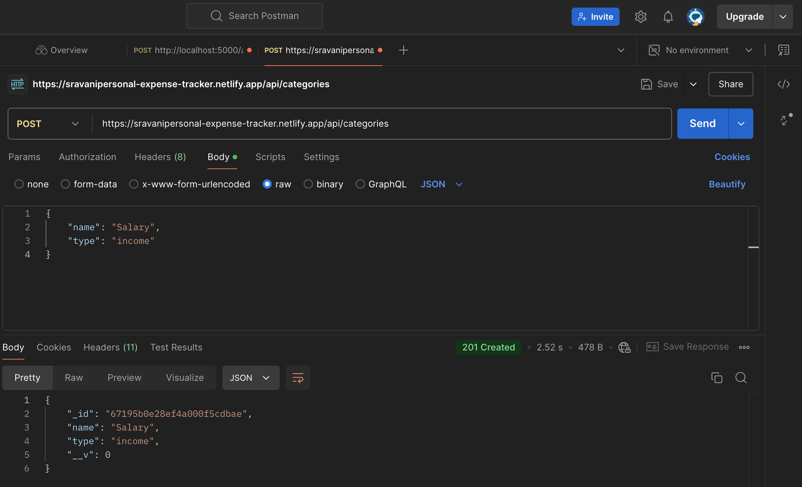
2. Retrieving All Categories
    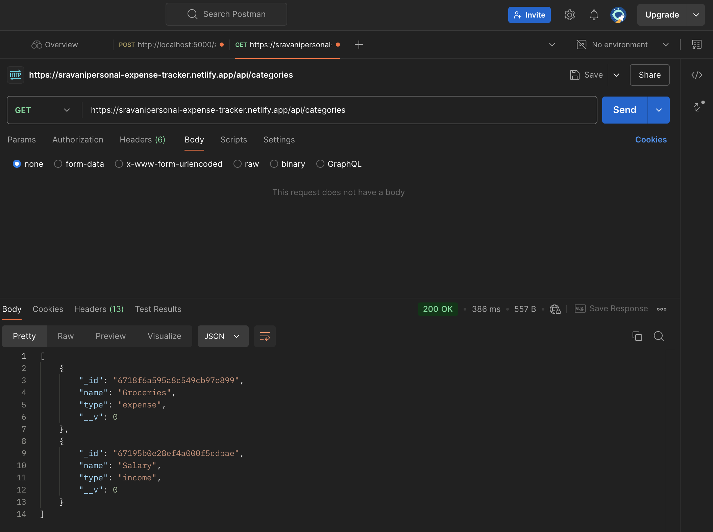
3. Retrieving a Category by ID
    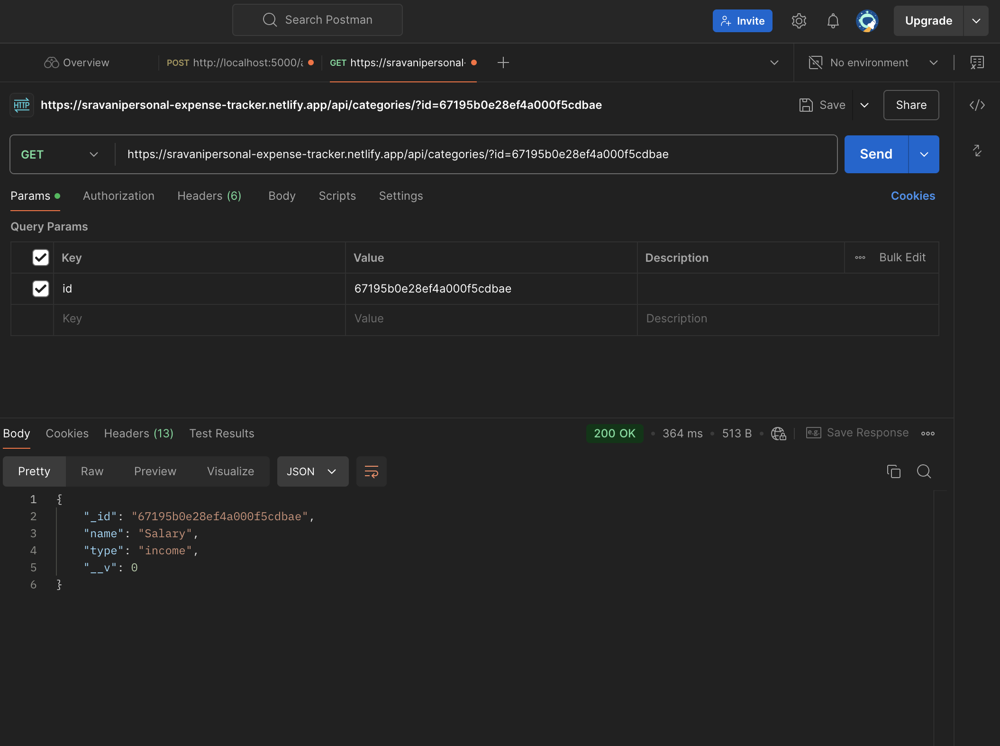
4. Updating a Category
    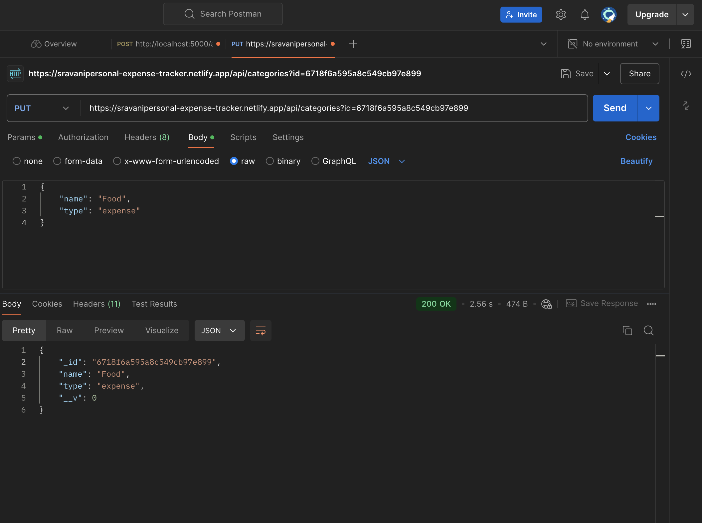
5. Deleting a Category
    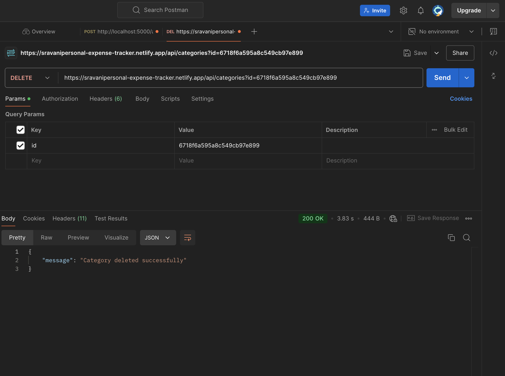

#### For Transactions
1. Adding a Transaction
    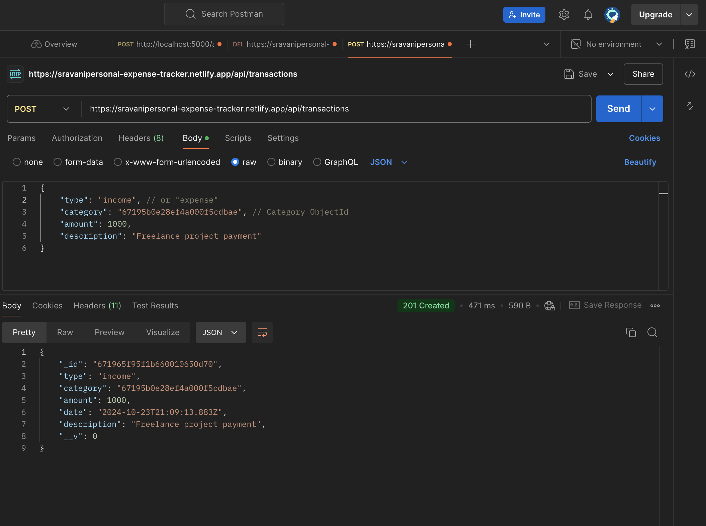
2. Retrieving All Transactions
    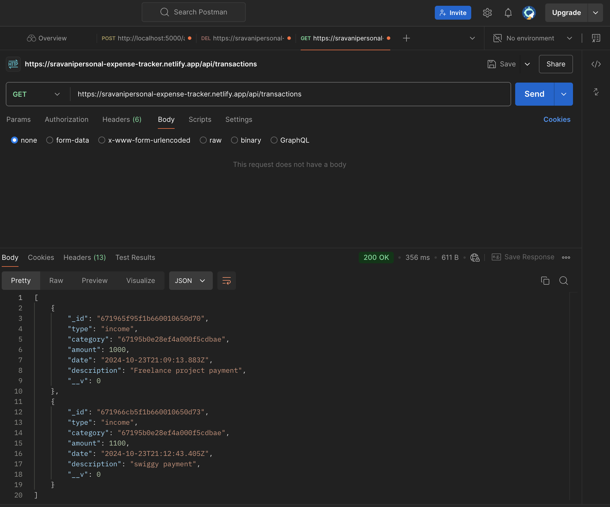
3. Retrieving a Transaction by ID
    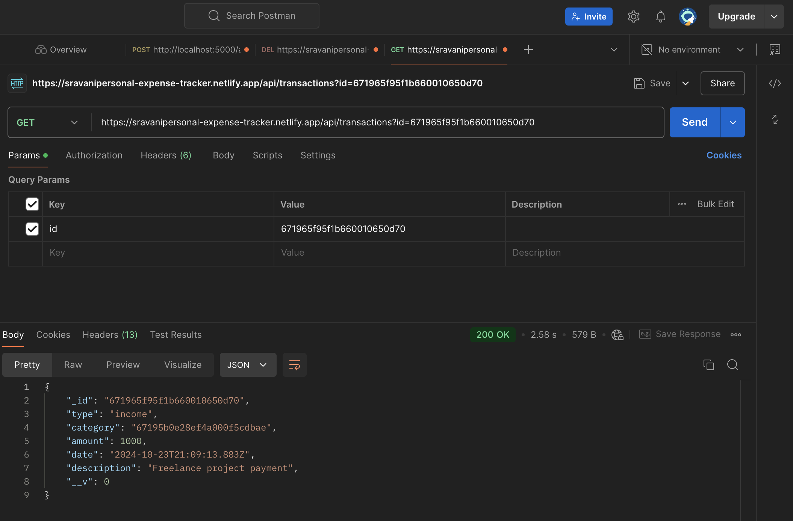
4. Updating a Transaction
    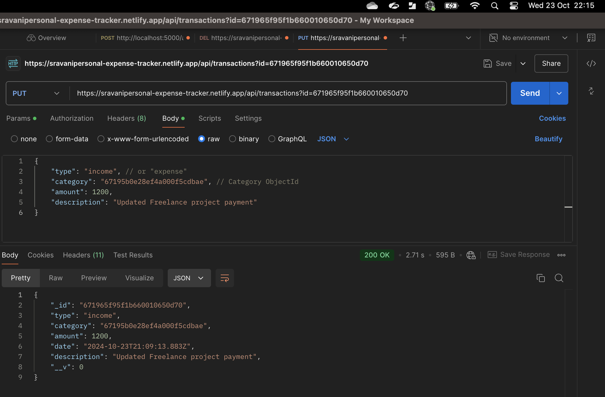
5. Deleting a Transaction
    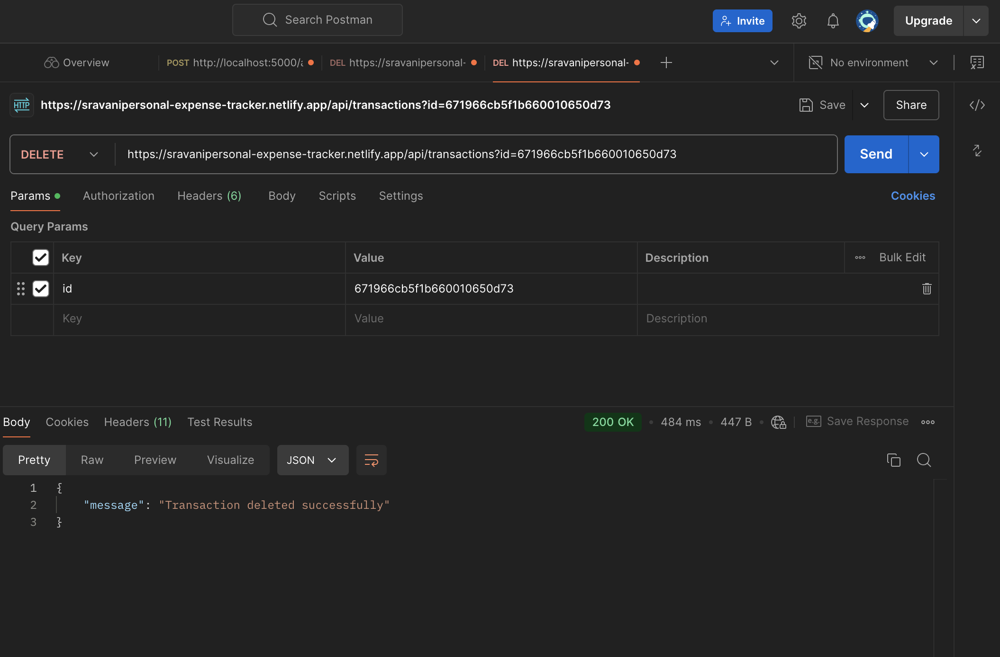
6. Getting a Summary
    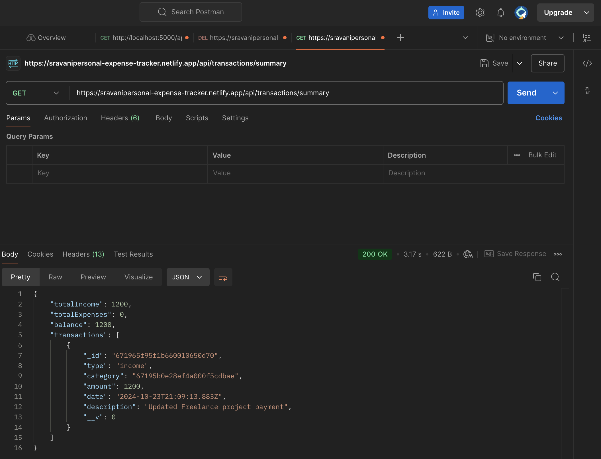
